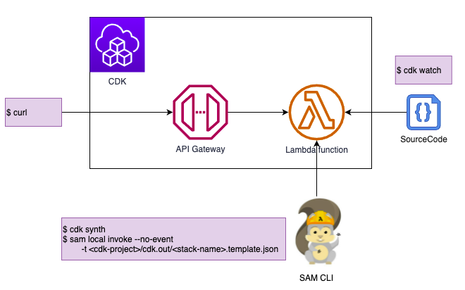

# Welcome to your CDK TypeScript project

This is a blank project for TypeScript development with CDK.

The `cdk.json` file tells the CDK Toolkit how to execute your app.

## Useful commands

* `npm run build`   compile typescript to js
* `npm run watch`   watch for changes and compile
* `npm run test`    perform the jest unit tests
* `cdk deploy`      deploy this stack to your default AWS account/region
* `cdk diff`        compare deployed stack with current state
* `cdk synth`       emits the synthesized CloudFormation template
* `cdk watch`       変更を継続的にリアルタイムに検知
* `sam local invoke --no-event -t <cdk-project>/cdk.out/<stack-name>.template.json` Lambda をローカル実行

## Overview



## IAM ポリシー

```json
{
    "Version": "2012-10-17",
    "Statement": [
        {
            "Sid": "AwsCdk",
            "Effect": "Allow",
            "Action": [
                "cloudformation:*",
                "cloudwatch:*",
                "ecr:*",
                "iam:*",
                "lambda:*",
                "logs:*",
                "ssm:*",
                "s3:*"
            ],
            "Resource": "*"
        }
    ]
}
```