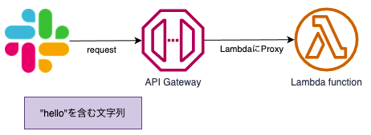

# Welcome to your CDK TypeScript project

This is a blank project for TypeScript development with CDK.

The `cdk.json` file tells the CDK Toolkit how to execute your app.

## Useful commands

* `npm run build`   compile typescript to js
* `npm run watch`   watch for changes and compile
* `npm run test`    perform the jest unit tests
* `cdk deploy`      deploy this stack to your default AWS account/region
* `cdk diff`        compare deployed stack with current state
* `cdk synth`       emits the synthesized CloudFormation template


# 開発メモ

## 概要



## AWS CDK
```bash
# CDKアプリ作成
mkdir slackbolt
cd slackbolt
cdk init 

# 依存ライブラリをインストール
npm install @slack/bolt
npm install @types/aws-lambda --save-dev

# 環境変数を設定
export SLACK_SIGNING_SECRET=<your-signing-secret>
export SLACK_BOT_TOKEN=xoxb-<your-bot-token>
# デプロイのみ
cdk deploy --require-approval never --profile <aws-configure-profile>
# 変更監視 & デプロイ
cdk watch --profile <aws-configure-profile>

# Lambdaのみをローカル実行
cdk synth
$ sam local invoke --no-event -t <cdk-project>/cdk.out/<stack-name>.template.json

# ローカル起動
npm run dev
ngrok http 3000
```

## Slackアプリ

### 新規作成

https://api.slack.com/apps?new_app=1

### Event Subscriptions

https://api.slack.com/apps/<アプリID>/event-subscriptions?

* Subscribe to bot events
  * message.channels
  * message.groups
  * message.im
  * message.mpim

### OAuth & Permissions

https://api.slack.com/apps/<アプリID>/oauth?

* Request URL
  * https://xxxxxxxxxx.execute-api.ap-northeast-1.amazonaws.com/prod/slack/events
  * → slack/eventsを追加して設定する

* Scopes
  * chat:write

## 参考資料

* [AWS Lambda へのデプロイ](https://slack.dev/bolt-js/ja-jp/deployments/aws-lambda)
